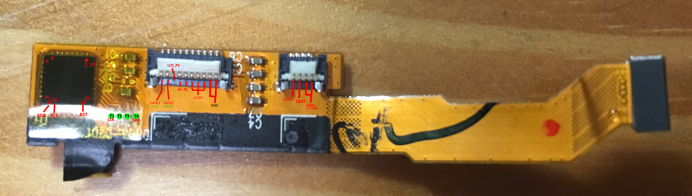

# Firmware
[barebone firmware for the Bip](https://github.com/dslul/Amazfitbip-FreeRTOS) that uses FreeRTOS and libopencm3.

To port [RebbleOS](https://github.com/ginge/FreeRTOS-Pebble), we need to switch first from the pheripheral library (that doesn't support the L4 family) they're currently using to libopencm3.

# Components

## MCU - [STM32L476JEY6](https://www.st.com/en/microcontrollers-microprocessors/stm32l476je.html)

Ultra-low-power with FPU ARM Cortex-M4 MCU 80 MHz with 512 Kbytes Flash, LCD, USB OTG, DFSDM.

[**Datasheet**](documents/STM32L476JEY6/DS10198.pdf)

[**Reference manual**](documents/STM32L476JEY6/RM0351.pdf)

[**Programming manual**](documents/STM32L476JEY6/PM0214.pdf)

## LCD - [JDI LPM013M126C](https://www.j-display.com/english/product/reflective.html)

1.28” MIP Reflective 3 bit Color LTPS TFT LCD with Back Light.

[**Datasheet**](documents/LPM013M126C/5LPM013M126C_specification_ver03.pdf)

[**Leaflet**](documents/LPM013M126C/5LL_1.28_square_BL_LPM013M126C.pdf)

## Touchscreen - [IT7259](http://www.ite.com.tw/en/product/view?mid=112)

Self-Cap Touch Controller for Wearable Device.

[**Datasheet**](documents/NOT YET FOUND)

Can someone who lives in China download it from csdn? https://download.csdn.net/download/raydom07/10628349

## Flash memory - [Winbond 25Q64FWIQ](http://www.winbond.com/hq/product/code-storage-flash-memory/serial-nor-flash/?__locale=e&partNo=W25Q64FW)

1.8V 64M-BIT serial flash memory with DUAL/QUAD SPI & QPI

[**Datasheet**](documents/25Q64FWIQ/w25q64fw_revk_07012016_sfdp.pdf)

## Bluetooth - [DA14580](https://www.dialog-semiconductor.com/products/connectivity/bluetooth-low-energy/smartbond-da14580-and-da14583)

Bluetooth 4.2 low energy SoC.

[**Datasheet**](documents/DA14580/da14580_fs_3v4.pdf)

[**Product brief**](documents/DA14580/smartbond_da1458x_family_product_brief_hr.pdf)

## GPS - [Sony CXD5603GF](https://www.sony-semicon.co.jp/products_en/gps/index.html)

GPS/GNSS Receiver and Positioning Engine Solution, with GPS/GLONASS & Galileo/BeiDou support.
In this configuration, there is a flash memory connected to the chip.

## Barometer - [DPS310](https://www.infineon.com/cms/en/product/sensor/barometric-pressure-sensor-for-consumer-applications/dps310/)

[**Datasheet**](documents/DPS310/Infineon-DPS310-DS-v01_00-EN.pdf)

[**Product brief**](documents/DPS310/Infineon-DPS310_Pressure_Sensor-PB-v02_00-EN.pdf)

## Accelerometer - [LIS2DH12](https://www.st.com/en/mems-and-sensors/lis2dh12.html)

3-axis MEMS accelerometer, ultra-low-power, ±2g/±4g/±8g/±16g full scale, high-speed I2C/SPI digital output, embedded FIFO, high-performance acceleration sensor, VFLGA package.

[**Datasheet**](documents/LIS2DH12/lis2dh12.pdf)

## Compass - [AK09918](https://www.digikey.com/catalog/en/partgroup/ak09918/70323)

3-axis electronic compass IC with high sensitive Hall sensor technology.

[**Datasheet**](documents/AK09918/AK09918C.pdf)

## Battery charger - [BQ24050](http://www.ti.com/product/BQ24050#)

1A, Single-Input, Single Cell Li-Ion Battery Charger with Automatic AC/USB Detection.

[**Datasheet**](documents/BQ24050/bq24050.pdf)

## Vital signs module - [AS7024](https://ams.com/as7024)

[**Datasheet**](documents/AS7024/AS7024_DS000469_4-00.pdf)

[**Product brief**](documents/AS7024/AS7024_FS000207_2-00.pdf)

## Step down voltage converter - [TPS62743](http://www.ti.com/product/TPS62743)

Ultra-low-power 300mA to 400mA Step-Down Buck DCDC Converter with 360nA Iq in WCSP package.

[**Datasheet**](documents/TPS62743/tps62743.pdf)

# Pinouts (thanks to Viktor_7)

